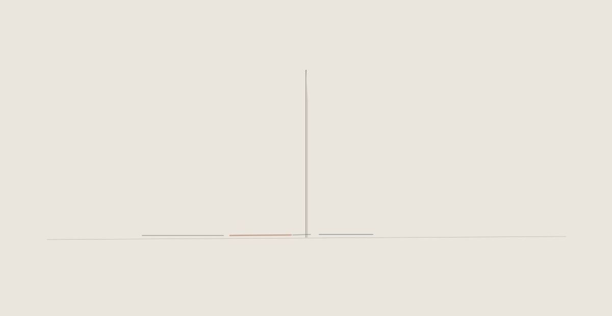

# A line left at the threshold

Separate visual study, 8 September 2026. Open [index.html](index.html) locally.
It is not linked from the house entrance and imports no house or room scripts.

The gesture is a narrow opening and one interrupted line that outlasts it. The
line loses colour over seven seconds; it carries no narration and starts no
sound. This tests a small residue at a transition without making Afterimage,
Listening or Archive disappear as independent rooms. The existing compositions
and their durations remain the basis of any future integration.

The study has no storage, network calls, room replacement or production switch.
Repeated gestures restart the same brief opening; reduced-motion preference
removes the transitions. The only decision proposed here is whether this sparse
visual residue is worth a later composition-specific study. No integration is
authorized by this preview.

Validation: HTML parsed and inline JavaScript syntax checked. The SVG still was
rendered and visually inspected. The available browser blocked local URLs, so
the HTML's animation timing and mobile behavior have not received a browser
review. The current house was separately checked on its existing public URL;
see [the recovery record](../../reviews/recovery-20260908.md).
